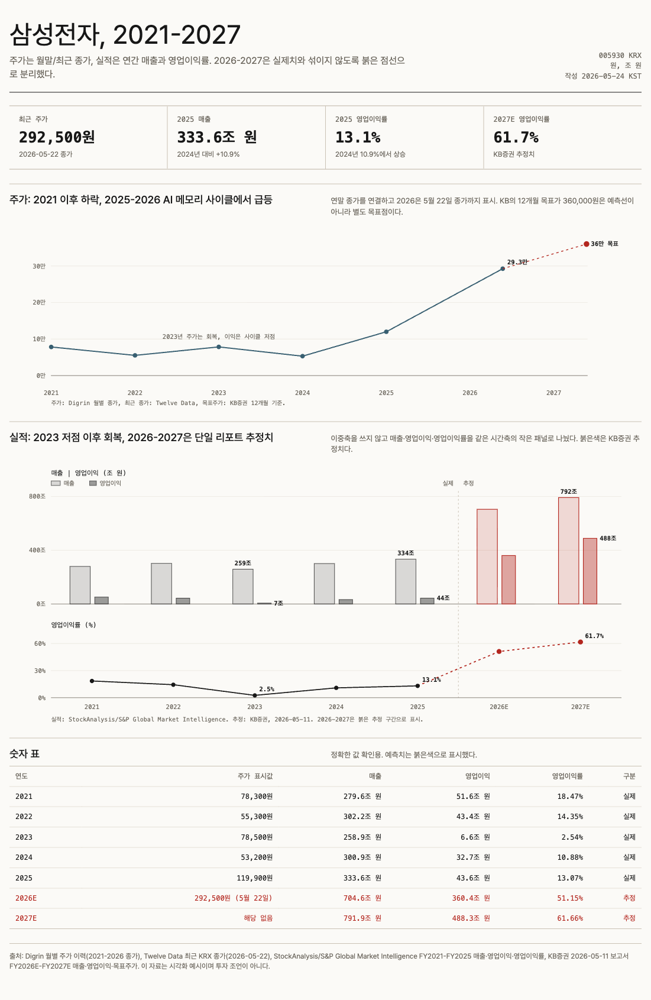
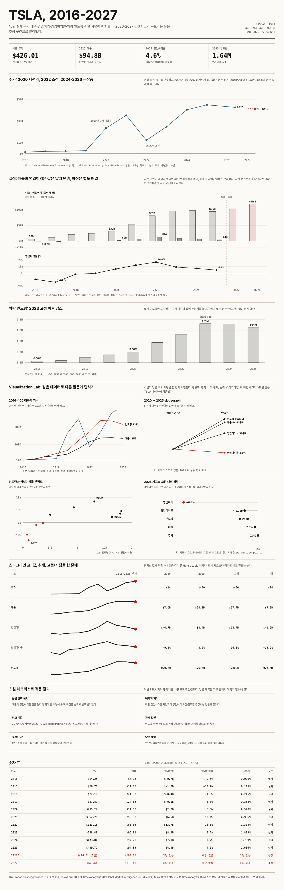
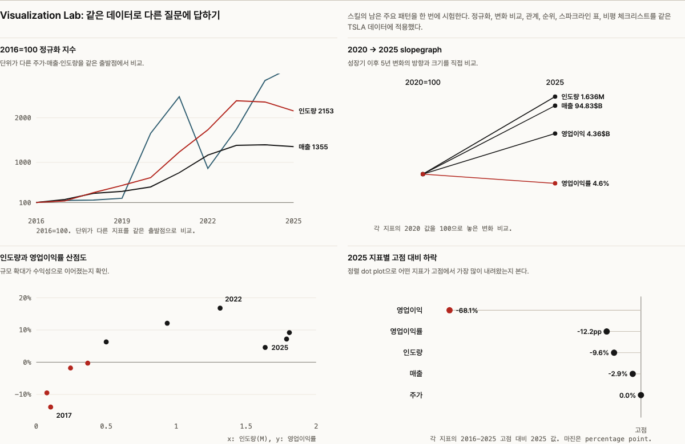
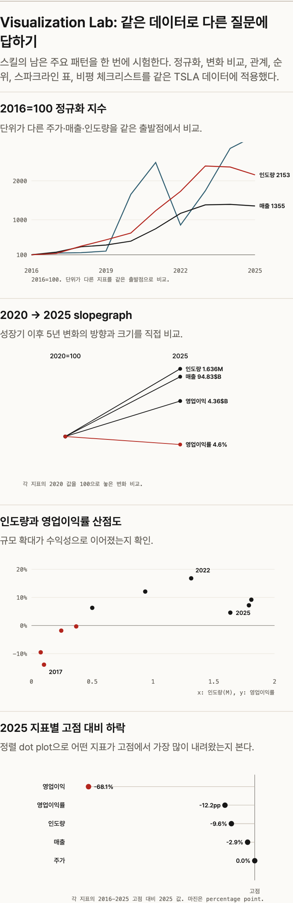

# Tufte Viz Codex

Codex skill for designing, critiquing, and implementing quantitative visualizations with Tufte-inspired analytical discipline.

[한국어 README](README.ko.md)

The goal is not decorative chart styling. The skill is optimized for analytical displays where comparisons, baselines, actual/estimate boundaries, labels, sources, and responsive behavior are explicit.

This is an independent, unofficial skill. It is inspired by public ideas associated with analytical information design and is not affiliated with, endorsed by, or sponsored by Edward Tufte, Graphics Press, OpenAI, Samsung, Tesla, Yahoo Finance, StockAnalysis, S&P Global, or KB Securities.

The included company examples are illustrative visual-design examples only. They are not investment research, financial advice, or a recommendation to buy or sell securities.

## Install

Clone this repo into a Codex skills directory:

```bash
git clone https://github.com/iamxoghks/tufte-viz-codex.git ~/.codex/skills/tufte-viz-codex
```

The skill entrypoint is [`SKILL.md`](SKILL.md).

## What This Skill Covers

- Chart selection from data shape and reader task.
- Same-unit grouped bars and grouped dots.
- Separate panels for unlike units or rates.
- Visual separation of actuals, estimates, targets, and assumptions.
- Data-integrity checks for sourced and forecasted data.
- Normalized index charts for unlike units.
- Slopegraphs for direct before/after comparison.
- Scatterplots for relationship questions.
- Dot plots for ranked distance from a peak, target, or benchmark.
- Sparkline tables for dense value plus trend reading.
- Mobile behavior that treats wide primary charts and compact repeated panels differently.
- Static HTML verification through `scripts/verify-html.js`.

The snippets below are shortened for documentation. Full runnable examples live in `examples/`.

## Templates

Use these as starting points for new static HTML artifacts:

- [`examples/templates/financial-actuals-estimates.html`](examples/templates/financial-actuals-estimates.html)
- [`examples/templates/visualization-lab.html`](examples/templates/visualization-lab.html)
- [`examples/templates/sparkline-table.html`](examples/templates/sparkline-table.html)
- [`examples/templates/small-multiples.html`](examples/templates/small-multiples.html)

Run the verifier against a generated HTML file when Playwright is available:

```bash
node scripts/verify-html.js examples/templates/visualization-lab.html
```

## Example 1: Samsung Financial Forecast

Question: after Samsung Electronics' 2023 trough, how did stock price, revenue, operating income, and operating margin change, and which sourced estimates are available?

Full example: [`examples/samsung-financial-forecast.html`](examples/samsung-financial-forecast.html)



### Features Used

- **Same-unit grouping**: revenue and operating income are both trillion KRW, so they share a grouped-bar panel.
- **Separate-unit panel**: operating margin is a percentage, so it is separated from money bars.
- **Forecast boundary**: 2026-2027 estimates are visually separated from actuals.
- **Direct labels**: important values are labeled next to bars and points instead of being hidden in tooltips.
- **Mobile fallback**: the wide report chart allows horizontal scroll on narrow screens.

```js
const yMoney = scale([0, 820], [moneyBottom, moneyTop]);
const yMargin = scale([0, 70], [marginBottom, marginTop]);

for (const d of data) {
  const stroke = d.type === "estimate" ? "var(--forecast)" : "var(--ink)";
  drawBar({ x: x(d.year) - 18, y: yMoney(d.revenue), fill: "revenue", stroke });
  drawBar({ x: x(d.year) + 8, y: yMoney(d.operatingProfit), fill: "profit", stroke });
}

drawLine(actuals.map(d => [x(d.year), yMargin(d.margin)]));
drawForecastRegion({ from: 2026, to: 2027 });
```

## Example 2: TSLA Dashboard

Question: how can one TSLA dataset answer several different analytical questions about price, revenue, operating income, margin, and deliveries?

Full example: [`examples/tsla-visualization-lab.html`](examples/tsla-visualization-lab.html)



### Primary Chart Features

- **Price line plus target marker**: actual adjusted closes are shown as a line; analyst target is a separate marker, not a future price prediction line.
- **Financial grouped bars plus margin panel**: revenue and operating income share a dollar scale; operating margin is separated into a lower percentage panel.
- **Delivery bars**: actual deliveries are kept separate so the production/demand cycle is not mixed with unavailable estimates.

```js
const actual = priceData.filter(d => d.type === "actual");
const target = priceData.find(d => d.type === "target");

svg.appendChild(el("path", {
  d: path(actual.map(d => [x(d.year), y(d.close)])),
  fill: "none",
  stroke: "var(--stock)"
}));

svg.appendChild(el("line", {
  x1: x(last.year),
  x2: x(target.year),
  y1: y(last.close),
  y2: y(target.close),
  stroke: "var(--forecast)",
  "stroke-dasharray": "4 5"
}));
```

## Example 3: Visualization Lab

The lab applies several chart patterns to the same TSLA data.



### Normalized Index

Use when units differ but the reader needs relative growth from a shared baseline.

```js
const series = [
  { name: "Price", values: actual.map(d => priceByYear.get(d.year) / priceByYear.get(2016) * 100) },
  { name: "Revenue", values: actual.map(d => d.revenue / actual[0].revenue * 100) },
  { name: "Deliveries", values: actual.map(d => d.deliveries / actual[0].deliveries * 100) }
];
```

### Slopegraph

Use for direct before/after comparison. In the TSLA example, each metric is indexed to 2020=100.

```js
const indexed = metrics.map(m => ({
  ...m,
  start: 100,
  end: m.b / m.a * 100
}));

for (const m of indexed) {
  const stroke = m.end < 100 ? "var(--forecast)" : "var(--ink)";
  drawSlope({ x0, x1, y0: y(m.start), y1: y(m.end), stroke });
}
```

### Scatterplot

Use when the question is about relationship, not time sequence. Here, deliveries are compared with operating margin.

```js
const x = scale([0, 2.0], [margin.left, margin.left + innerW]);
const y = scale([-16, 20], [margin.top + innerH, margin.top]);

for (const d of financialData.filter(d => d.type === "actual")) {
  drawPoint({
    cx: x(d.deliveries),
    cy: y(d.margin),
    color: d.margin < 0 ? "var(--forecast)" : "var(--ink)"
  });
}
```

### Ranked Dot Plot

Use when each value is a distance from the same peak, target, or benchmark.

```js
const rows = [
  { name: "Revenue", value: last.revenue / maxRevenue - 1 },
  { name: "Deliveries", value: last.deliveries / maxDeliveries - 1 },
  { name: "Operating income", value: last.op / maxOperatingProfit - 1 },
  { name: "Operating margin", value: last.margin - maxMargin }
].sort((a, b) => a.value - b.value);
```

### Sparkline Table

Use when exact values and trend shape both matter.

```js
function sparkline(values, width = 150, height = 28) {
  const x = scale([0, values.length - 1], [2, width - 2]);
  const y = scale([Math.min(...values), Math.max(...values)], [height - 3, 3]);
  return path(values.map((v, i) => [x(i), y(v)]));
}
```

## Responsive Lesson

Wide primary charts and compact lab panels need different mobile rules.

```css
.wide-chart svg {
  width: 760px;
  max-width: none;
}

.lab-panel .chart svg {
  width: 100%;
  max-width: 100%;
}
```



## References

- [`references/chart-selection.md`](references/chart-selection.md)
- [`references/analytical-design.md`](references/analytical-design.md)
- [`references/data-integrity.md`](references/data-integrity.md)
- [`references/integrity-checklist.md`](references/integrity-checklist.md)
- [`references/web-implementation.md`](references/web-implementation.md)

## License

MIT. See [`LICENSE`](LICENSE).
